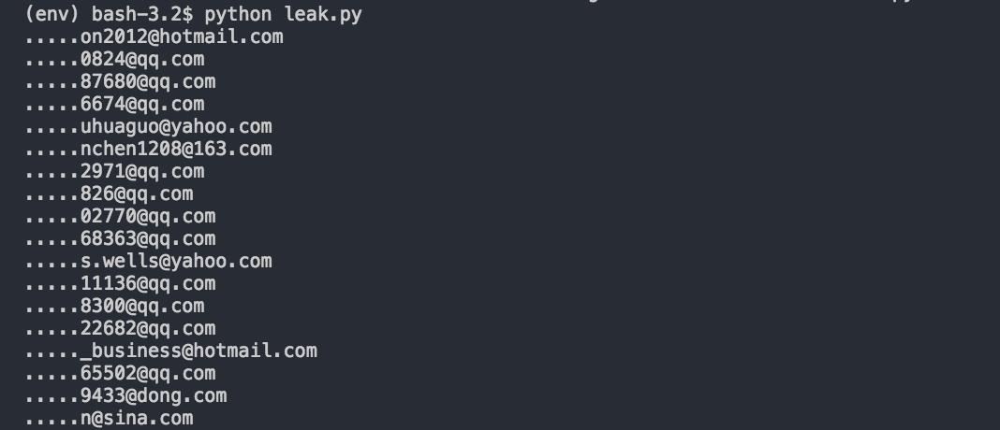

```
UPDATE: I notified Apple, and it looks like they've patched it now.
```

Apple ID Data Leak
=========

This script produces Apple ID's straight from the login form on Apple.com.

How does it work?
-----------------
The other day, I noticed Apple has been autofilling the value of the 'Apple ID' field with random
email addresses; this happens every now and then. The script basically spins up 
several threads, makes requests to the login page, and prints the autofilled email address
if it exists.

Setup
-----
```
pip install -r requirements.txt
```

Usage
-----
```
python leak.py
```

License
-------
MIT